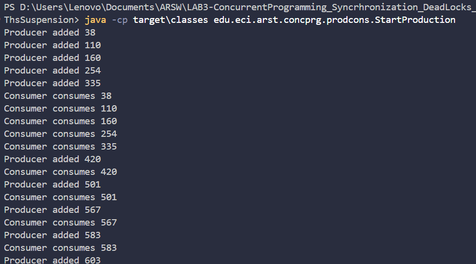

Parte I

Revisando el funcionamiento del programa podemos ver que utiliza el patron del Consumidor y el Productor con 2 hilos trabajando entre si, basicamente el hilo principal inicia una cola compartida bloqueada que simula una fila en una tienda. Con ello el hilo del productor empieza a hacer productos, el hilo principal espera 5 segundos como diciendo "Esperemos que el productor tenga inventario" y luego el consumidor empieza a consumir productos, vemos que el productor hace productos muy lento como 1 producto por segundo y luego el consumidor los consume muy rapido, haciendo que luego el consumidor este tiempo esperando para consumir, aqui se puede ver una ejecucion:

 //width 
